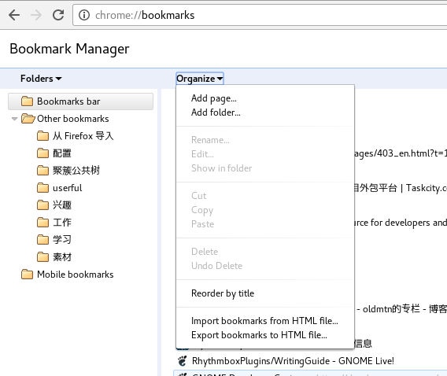

## 说明

一个聚簇的简单demo，对chrom导出收藏夹进行简单分类。
仅在linux上进行测试，没有在windows和mac上测试

## 安装依赖

在文件夹下输入命令：
```shell
pip install -r requirements.txt
```

## 使用

文件下输入下面命令，查看帮助文档：
```shell
python ./cluster.py -h
usage: cluster.py [-h] [-k KVALUE] -m {hierarchical,kmeans} -f FILE [-d] [-p PROXY]

chrome 书签自动分类工具

optional arguments:
  -h, --help            show this help message and exit
  -k KVALUE, --kvalue KVALUE
                        聚簇的个数，将书签分为多少个簇
  -m {hierarchical,kmeans}, --method {hierarchical,kmeans}
                        选择聚类方法只有两种可选，kmeans和hierarchical
  -f FILE, --file FILE  书签文件的路径
  -d, --debug           开启调试模式
  -p PROXY, --proxy PROXY
                        页面抓取时使用代理
```
例如使用文件包自带的例子使用如下命令：
```shell
python cluster.py -m hierarchical -f ./bookmarks_demo.html -k 15
```
上述命令的含义是使用层次聚簇，聚为15个簇

## 自己测试
首先需要导出你的chrome收藏夹。在chrome地址栏输入：
```plain
chrome://bookmarks/
```
在打开页面中点击`organize` ---->>> `Export bookmarks to HTML file`

如下图：
  

保存文件后可以将文件路径作为上述命令的书签文件路径即可运行。
